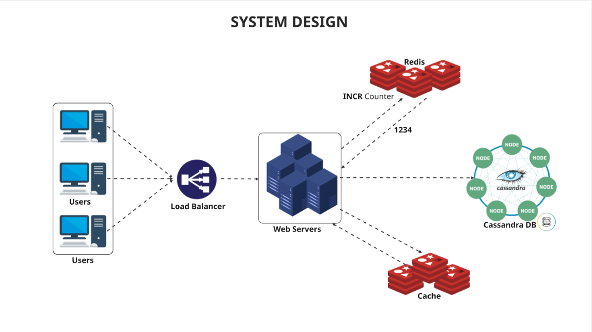

# END-POINTS
## POST 
Request
api/v1/shorten
Body: {"url": "www.exmple.com..."}

Response
Status Code 201
{ "short_url": "bit.ly/zn9e10A" }

## GET
Response
api/v1/shorten
Status Code 300/301
{ long_url: 'www.example.com...' }

# Requisitos Funcionais
* Encutamento de URL: dado um URL longo

# Requisitos não funcionais
* O sistema deve suportar 100 milhões de URLs geradas por dia
* O tamanho da URL encurtada deve ser o mais curto possível
* Somente números (0-9) e caracteres (az, AZ) são permitidos na URL
* Para cada 1 operação de gravação no banco de dados, haverão 10 operações de leitura
* O comprimento medio das URLs armazenadas é de 100 bytes
* URLs devem ser armazenadas pelo periodo minimo de 10 anos
* O sistema deve operar em modo de alta disponibilidade (24/7)

# Calculos de estimativas:
## Operações de gravação
RnF: O sistema deve suportar 100 milhões de URLs geradas por dia

100 milhões por dia

**Calculos**:
Valor de 24 horas em segundos: 24 / 60 / 60 = 0.0066
Quantidade de requisições por segundo: 100.000.000 / 0.0066 = 1157

## Operações de leitura
RnF: Para cada 1 operação de gravação no banco de dados, haverão 10 operações de leitura
10 operações de leitura por gravação

**Calculos**:
Quantidade de leituras por segundo: 1157 * 10 = 11.570

## Tempo de armazenamento das URLs
RnF: URLs devem ser armazenadas pelo periodo minimo de 10 anos
10 anos de armazenamento de URLs na base de dados

**Calculos**:
Quantidade de URLs armazenadas: 100.000.000 * 365 * 10 = 365 bilhões de registros

## Capacidade de armazenamento
RnF: O comprimento medio das URLs armazenadas é de 100 bytes
cada URL deve ocupar até 100 bytes no armazenamento

**Calculos**:
Capacidade de armazenamento: 365.000.000.000 * 100 = 36.5Tb

# Banco de dados
RnF: O sistema deve operar em modo de alta disponibilidade (24/7)

## Cassandra
dados:
shortcode
long_url
created_at

# Calculo tamanho da URL
Rnf: 
* O tamanho da URL encurtada deve ser o mais curto possível
* Somente números (0-9) e caracteres (az, AZ) são permitidos na URL

10 digitos numericos: 0-9
26 letras minusculas: a-z
26 letras maiusculas: A-Z
**total: 62 caracteres** ou **base62**

## Calcular possíbilidades de combinações
Quantidade de caracteres que a URL encurtada precisa usar

|qtdCaracteres | número máximo de URLs          |
|1             | 62 ^ 1 = 62                    |
|2             | 62 ^ 2 = 3.844                 |
|3             | 62 ^ 3 = 238.328               |
|4             | 62 ^ 4 = 14.776,336            |
|5             | 62 ^ 5 = 916.132,832           |
|6             | 62 ^ 6 = 56.800.235.584        |
|7             | **62 ^ 7 = 3.521.614.606.208** |

## Escolher função de HASH
**Conversão de base 62**
Exemplo:
Para representar o número 11157 na base 62, basta dividi-lo por 62 e usar o resto da divisão
62 / 11157 = 179 (resto 59) 59 = x
62 / 179 = 2 (resto 55) = 55 = t
62 / 2 = 0 (resto 2) 2 = 2

**Exemplo final: https://bit.ly/2tx**

# Segurança
**Encriptrar URL encurtada**
Essa estrategia garante que mesmo que as URLs sejam salvas de forma incremental na base de dados, alguem mal intensionado não consiga encontrar o padrão de geração.

# System design

USERS -> LOAD BALANCER -> WEB SERVER (redis - cluster mode INCR Counter) -> DATABASE